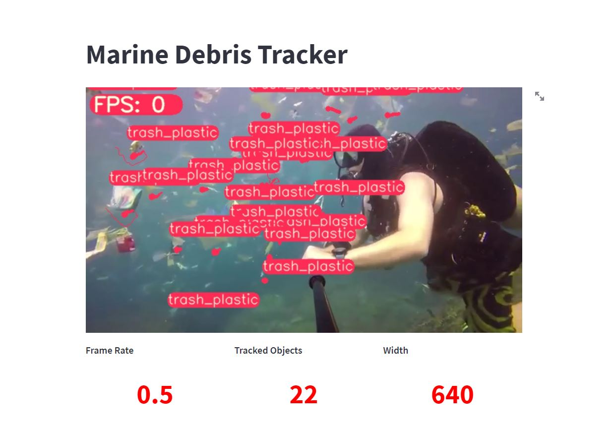

# Project Title: Marine Debris Tracker (Nasa Space Apps Challenge)
---

## Project Details

This Project is capable of detecting Marine Debris given an Image or Video. There is a Web Dashboard that the user can interact with. We trained a custom model based on an Open-Source Dataset of Plastics.

### Features:

- **Real Time Dashboard:** There is an interactive dashboard that shows the output result  of the Yolo-R Model.

- **Custom Parameter Tuning:** Users can change the parameters of the Model in Real Time with Slider.

- **Fine-Tuned Model:** We trained our fine-tuned model on an open-source dataset.

